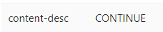

# HexEngine - Mobile Automation Solution

## Tech Stack

This document provides an overview of the technologies used in the automation framework.

## Python
Used for scripting and writing automation logic.

## Appium
A tool for mobile automation, enabling interaction with mobile applications across different platforms.

## pytest
A framework for test execution and reporting, offering powerful features for writing scalable tests.

## Selenium/WebDriver
Used for testing web views inside mobile apps, ensuring proper functionality and compatibility.

## Allure Report
A test reporting tool that provides detailed insights into test execution results.

## Logging
Utilized to track execution flow and failures, aiding in debugging and analysis.

## CI/CD
Integrated with Jenkins/GitHub Actions to automate the testing process, ensuring continuous integration and deployment.


get all installed packages

`pip freeze > requirements.txt`

To Install Packages from requirements.txt

`pip install -r requirements.txt`
## content-desc


### use

`    
"continue_text_button": {
    "locator_type": "content",
        "locator": "CONTINUE"
      }
`

Emoji cheat sheet

`https://www.webfx.com/tools/emoji-cheat-sheet`

Methods:
tap_on_element
double_tap_on_element
enter_text
swipe_element_to_element
swipe_by_direction
swipe_by_coordinates
text_print

element_visible
element_not_visible
element_present
long_press_element
multi_tap

## Device Class Documentation

The `Device` class provides essential device management functionality for mobile testing automation.

### Device(driver)
**Description:** Initialize Device class with Appium driver
**Parameters:**
- `driver`: Appium WebDriver instance (required)
**Raises:**
- `ValueError`: If driver is None
**Example:**
```python
from framework.mobile.device import Device
device = Device(driver)
```

### get_device_battery_level()
**Description:** Gets the current battery level of the device
**Parameters:** None
**Returns:** int - Battery level percentage (0-100)
**Raises:**
- `Exception`: If unable to retrieve battery information
**Example:**
```python
# Get current battery level
battery_level = device.get_device_battery_level()
print(f"Current battery: {battery_level}%")

# Use in test conditions
if battery_level < 20:
    print("Warning: Low battery detected")
```

### rotate_device(orientation)
**Description:** Rotates the device to the specified orientation
**Parameters:**
- `orientation` (str): Desired orientation ('PORTRAIT', 'LANDSCAPE', 'PORTRAIT_REVERSE', 'LANDSCAPE_REVERSE')
**Raises:**
- `ValueError`: If orientation is invalid
- `Exception`: If rotation fails
**Example:**
```python
# Rotate to landscape for video playback
device.rotate_device('LANDSCAPE')

# Test app behavior in different orientations
device.rotate_device('PORTRAIT')
device.rotate_device('LANDSCAPE_REVERSE')
```

### lock_device(duration=None)
**Description:** Locks the device for a specified duration or indefinitely
**Parameters:**
- `duration` (int, optional): Duration in seconds to keep device locked. If None, device stays locked until unlock_device is called
**Raises:**
- `Exception`: If locking fails
**Example:**
```python
# Lock device indefinitely
device.lock_device()

# Lock device for 5 seconds (auto-unlock)
device.lock_device(duration=5)

# Test app behavior when returning from locked state
device.lock_device(duration=3)
# App should handle the lock/unlock cycle gracefully
```

### unlock_device(password=None)
**Description:** Unlocks the device with optional password/PIN entry
**Parameters:**
- `password` (str, optional): Password/PIN to unlock the device (numeric only)
**Raises:**
- `Exception`: If unlocking fails
**Example:**
```python
# Unlock device without password
device.unlock_device()

# Unlock device with PIN
device.unlock_device(password="1234")

# Test secure unlock flow
device.lock_device()
device.unlock_device(password="0000")
```

## Element Class Documentation

The `Element` class provides comprehensive element interaction functionality for mobile testing automation.

### Element(driver, file_path)
**Description:** Initializes the Element class with a WebDriver instance and locators file path for element interactions.
**Parameters:**
- `driver`: WebDriver instance (required)
- `file_path` (str): Path to JSON file containing element locators (required)
**Raises:**
- `ValueError`: If driver or file_path is None
**Examples:**
```python
element = Element(driver, "locators/login_page.json")
```

### tap_on_element(locator_name, timeout=10)
**Description:** Clicks on the specified element.
**Parameters:**
- `locator_name` (str): Name of the locator in the JSON file
- `timeout` (int): Maximum time to wait for element (default: 10 seconds)
**Raises:**
- `TimeoutException`: If element not clickable after timeout
- `ValueError`: If unsupported locator type
**Examples:**
```python
element.tap_on_element("login_button")
element.tap_on_element("submit_btn", timeout=15)
```

### multi_tap(locator_name, tap_count=1, timeout=10)
**Description:** Clicks on an element multiple times.
**Parameters:**
- `locator_name` (str): Name of the locator in the JSON file
- `tap_count` (int): Number of times to click (default: 1)
- `timeout` (int): Maximum time to wait for element (default: 10 seconds)
**Raises:**
- `TimeoutException`: If element not clickable after timeout
**Examples:**
```python
element.multi_tap("increment_button", tap_count=5)
element.multi_tap("like_button", tap_count=2, timeout=15)
```

### long_press_element(locator_name, duration=1000, timeout=10)
**Description:** Performs a long press on the specified element.
**Parameters:**
- `locator_name` (str): Name of the locator in the JSON file
- `duration` (int): Duration to hold press in milliseconds (default: 1000ms)
- `timeout` (int): Maximum time to wait for element (default: 10 seconds)
**Raises:**
- `TimeoutException`: If element not clickable after timeout
**Examples:**
```python
element.long_press_element("context_menu_item")
element.long_press_element("image", duration=2000)
```

### enter_text(locator_name, text_to_enter, timeout=10)
**Description:** Enters text into the specified element.
**Parameters:**
- `locator_name` (str): Name of the locator in the JSON file
- `text_to_enter` (str): Text to enter into the element
- `timeout` (int): Maximum time to wait for element (default: 10 seconds)
**Raises:**
- `TimeoutException`: If element not present after timeout
**Examples:**
```python
element.enter_text("username_field", "john.doe@example.com")
element.enter_text("password_field", "mypassword123")
```

### clear_and_enter_text(locator_name, text_to_enter, timeout=10)
**Description:** Clears existing text and enters new text into the specified element.
**Parameters:**
- `locator_name` (str): Name of the locator in the JSON file
- `text_to_enter` (str): Text to enter into the element
- `timeout` (int): Maximum time to wait for element (default: 10 seconds)
**Raises:**
- `TimeoutException`: If element not present after timeout
**Examples:**
```python
element.clear_and_enter_text("search_field", "new search term")
```

### clear_text(locator_name, timeout=10)
**Description:** Clears existing text from the specified element.
**Parameters:**
- `locator_name` (str): Name of the locator in the JSON file
- `timeout` (int): Maximum time to wait for element (default: 10 seconds)
**Raises:**
- `TimeoutException`: If element not present after timeout
**Examples:**
```python
element.clear_text("input_field")
```

### enter_text_from_file(locator_name, file_name, cell_reference, sheet_name=None)
**Description:** Reads a value from a file (CSV or Excel) and enters it into the specified element.
**Parameters:**
- `locator_name` (str): Name of the locator in the JSON file
- `file_name` (str): Name of the file to read data from (.csv or .xlsx)
- `cell_reference` (str): Cell reference (e.g., 'A1' for Excel, column name for CSV)
- `sheet_name` (str, optional): Sheet name (required for Excel files)
**Raises:**
- `ValueError`: If value is empty or file type unsupported
**Examples:**
```python
element.enter_text_from_file("username_field", "test_data.xlsx", "A1", "Sheet1")
element.enter_text_from_file("email_field", "users.csv", "email")
```

### swipe_element_to_element(start_locator_name, end_locator_name, duration=500, timeout=10)
**Description:** Swipes from one element to another.
**Parameters:**
- `start_locator_name` (str): Locator name for start element
- `end_locator_name` (str): Locator name for end element
- `duration` (int): Duration in milliseconds (default: 500ms)
- `timeout` (int): Wait timeout for elements (default: 10 seconds)
**Raises:**
- `Exception`: If swipe operation fails
**Examples:**
```python
element.swipe_element_to_element("item1", "item5")
element.swipe_element_to_element("start_point", "end_point", duration=1000)
```

### swipe_by_direction(direction, duration=None, percentage=0.75)
**Description:** Swipes in the specified direction based on screen size.
**Parameters:**
- `direction` (str): Direction to swipe ('left', 'right', 'up', 'down')
- `duration` (int, optional): Time in milliseconds for swipe action
- `percentage` (float): Percentage of screen to swipe (0.0 to 1.0, default: 0.75)
**Raises:**
- `ValueError`: If direction is invalid
**Examples:**
```python
element.swipe_by_direction('left')
element.swipe_by_direction('up', duration=300, percentage=0.5)
```

### swipe_by_coordinates(start_x, start_y, end_x, end_y, duration=500)
**Description:** Swipes from one coordinate to another.
**Parameters:**
- `start_x` (int): Starting x coordinate
- `start_y` (int): Starting y coordinate
- `end_x` (int): Ending x coordinate
- `end_y` (int): Ending y coordinate
- `duration` (int): Duration in milliseconds (default: 500ms)
**Raises:**
- `Exception`: If swipe operation fails
**Examples:**
```python
element.swipe_by_coordinates(100, 200, 300, 400)
element.swipe_by_coordinates(0, 500, 400, 500, duration=1000)
```

### get_text(locator_name, timeout=10)
**Description:** Gets text from the specified element.
**Parameters:**
- `locator_name` (str): Name of the locator in the JSON file
- `timeout` (int): Maximum time to wait for element (default: 10 seconds)
**Raises:**
- `TimeoutException`: If element not present after timeout
**Examples:**
```python
text = element.get_text("status_label")
print(f"Status: {text}")
```

### get_attribute(locator_name, attribute_name, timeout=10)
**Description:** Gets attribute value from the specified element.
**Parameters:**
- `locator_name` (str): Name of the locator in the JSON file
- `attribute_name` (str): Name of the attribute to retrieve
- `timeout` (int): Maximum time to wait for element (default: 10 seconds)
**Raises:**
- `TimeoutException`: If element not present after timeout
**Examples:**
```python
value = element.get_attribute("input_field", "value")
class_name = element.get_attribute("button", "class")
```

### take_element_screenshot(locator_name, filename=None, timeout=10)
**Description:** Takes a screenshot of the specified element.
**Parameters:**
- `locator_name` (str): Name of the locator in the JSON file
- `filename` (str, optional): Name for screenshot file
- `timeout` (int): Maximum time to wait for element (default: 10 seconds)
**Raises:**
- `TimeoutException`: If element not present after timeout
**Examples:**
```python
path = element.take_element_screenshot("error_message")
path = element.take_element_screenshot("chart", "chart_screenshot.png")
```

### compare_element_screenshots(locator_name, baseline_image, threshold=0.95, timeout=10)
**Description:** Compares current element screenshot with baseline image.
**Parameters:**
- `locator_name` (str): Name of the locator in the JSON file
- `baseline_image` (str): Name of baseline image file in baseline_img folder
- `threshold` (float): Similarity threshold (0.0 to 1.0, default: 0.95)
- `timeout` (int): Maximum time to wait for element (default: 10 seconds)
**Raises:**
- `FileNotFoundError`: If baseline image not found
**Examples:**
```python
matches = element.compare_element_screenshots("logo", "baseline_logo.png")
matches = element.compare_element_screenshots("chart", "expected_chart", threshold=0.90)
```

### take_full_screenshot(filename=None)
**Description:** Takes a screenshot of the entire screen.
**Parameters:**
- `filename` (str, optional): Name for screenshot file
**Raises:**
- `Exception`: If screenshot operation fails
**Examples:**
```python
path = element.take_full_screenshot()
path = element.take_full_screenshot("full_page_screenshot.png")
```

### compare_full_screenshots(baseline_image, threshold=0.95)
**Description:** Compares current full screen screenshot with baseline image.
**Parameters:**
- `baseline_image` (str): Name of baseline image file in baseline_img folder
- `threshold` (float): Similarity threshold (0.0 to 1.0, default: 0.95)
**Raises:**
- `FileNotFoundError`: If baseline image not found
**Examples:**
```python
matches = element.compare_full_screenshots("baseline_page.png")
matches = element.compare_full_screenshots("expected_screen", threshold=0.90)
```

### start_screen_recording(quality='low')
**Description:** Starts screen recording on the mobile device.
**Parameters:**
- `quality` (str): Recording quality - 'low', 'medium', or 'high' (default: 'low')
**Raises:**
- `Exception`: If recording start fails
**Examples:**
```python
element.start_screen_recording()
element.start_screen_recording(quality='high')
```

### stop_screen_recording(filename=None)
**Description:** Stops screen recording and saves it.
**Parameters:**
- `filename` (str, optional): Name for recording file
**Raises:**
- `Exception`: If recording stop fails
**Examples:**
```python
path = element.stop_screen_recording()
path = element.stop_screen_recording("test_recording.mp4")
```

### get_device_logs(filename=None)
**Description:** Gets device logs and saves them to a file.
**Parameters:**
- `filename` (str, optional): Name for log file
**Raises:**
- `Exception`: If log retrieval fails
**Examples:**
```python
path = element.get_device_logs()
path = element.get_device_logs("test_logs.txt")
```

### pinch_to_zoom(locator_name, scale_factor=2.0, duration=None, timeout=10)
**Description:** Performs a pinch gesture to zoom in or out on an element.
**Parameters:**
- `locator_name` (str): Name of the locator in the JSON file
- `scale_factor` (float): Scale factor for zoom (>1.0 zoom in, <1.0 zoom out, default: 2.0)
- `duration` (int, optional): Time in milliseconds for pinch action
- `timeout` (int): Maximum time to wait for element (default: 10 seconds)
**Raises:**
- `TimeoutException`: If element not found after timeout
**Examples:**
```python
element.pinch_to_zoom('image_element')  # Zoom in
element.pinch_to_zoom('map', scale_factor=0.5)  # Zoom out
element.pinch_to_zoom('photo', scale_factor=3.0, duration=1000)
```

### scroll_page(direction="down", amount=300)
**Description:** Scrolls the page in the given direction.
**Parameters:**
- `direction` (str): 'up' or 'down' (default: 'down')
- `amount` (int): Amount to scroll in pixels (default: 300)
**Raises:**
- `ValueError`: If direction is invalid
**Examples:**
```python
element.scroll_page()
element.scroll_page(direction="up", amount=500)
```

### scroll_until_visible(locator_name, direction="down", max_attempts=20, timeout=5)
**Description:** Scrolls until the element becomes visible.
**Parameters:**
- `locator_name` (str): Name of the locator in the JSON file
- `direction` (str): Scroll direction (default: 'down')
- `max_attempts` (int): Maximum scroll attempts (default: 20)
- `timeout` (int): Wait time after each scroll (default: 5 seconds)
**Raises:**
- `TimeoutException`: If element not visible after max attempts
**Examples:**
```python
element.scroll_until_visible("footer_link")
element.scroll_until_visible("item", direction="up", max_attempts=10)
```

### hide_keyboard()
**Description:** Hides the on-screen keyboard if open.
**Parameters:** None
**Raises:** None (logs error if fails)
**Examples:**
```python
element.hide_keyboard()
```

### show_keyboard()
**Description:** Attempts to show the on-screen keyboard (Android only).
**Parameters:** None
**Raises:** None (logs error if fails)
**Examples:**
```python
element.show_keyboard()
```

### press_number_keys(numbers)
**Description:** Presses number keys on the device.
**Parameters:**
- `numbers`: String of numbers (e.g., "123") or list of integers
**Raises:**
- `ValueError`: If invalid number provided
**Examples:**
```python
element.press_number_keys("123")
element.press_number_keys([1, 2, 3, 4])
```

### open_url_in_chrome(url, wait_time=10)
**Description:** Launches Chrome and navigates to specified URL.
**Parameters:**
- `url` (str): URL to open
- `wait_time` (int): Seconds to wait for Chrome address bar (default: 10)
**Raises:**
- `Exception`: If Chrome launch or navigation fails
**Examples:**
```python
element.open_url_in_chrome("https://www.example.com")
element.open_url_in_chrome("https://google.com", wait_time=15)
```

### scroll_by_coordinates(start_x, start_y, end_x, end_y, duration=500)
**Description:** Scrolls from one coordinate to another.
**Parameters:**
- `start_x` (int): Starting x coordinate
- `start_y` (int): Starting y coordinate
- `end_x` (int): Ending x coordinate
- `end_y` (int): Ending y coordinate
- `duration` (int): Duration in milliseconds (default: 500ms)
**Raises:**
- `Exception`: If scroll operation fails
**Examples:**
```python
element.scroll_by_coordinates(100, 200, 100, 600)
element.scroll_by_coordinates(200, 300, 200, 100, duration=1000)
```

### tap_and_get_clipboard_text(locator_name, timeout=10, pause_after_click=1)
**Description:** Taps on element and retrieves clipboard text.
**Parameters:**
- `locator_name` (str): Name of the locator in the JSON file
- `timeout` (int): Maximum time to wait for element (default: 10 seconds)
- `pause_after_click` (int): Seconds to wait after click (default: 1)
**Raises:**
- `TimeoutException`: If element not clickable after timeout
**Examples:**
```python
clipboard_text = element.tap_and_get_clipboard_text("copy_button")
text = element.tap_and_get_clipboard_text("share_link", pause_after_click=2)
```


## Android TV
```
    "androidTV": {
      "platform": "android",
      "appPath/appPackage": "com.google.android.apps.tv.launcherx",
      "platformVersion": "11",
      "deviceName": "Smart TV",
      "automationName": "UiAutomator2",
      "appActivity": "com.google.android.apps.tv.launcherx.home.HomeActivity",
      "capabilities": {
        "appWaitDuration": 30000,
        "newCommandTimeout": 60,
        "noReset": true,
        "autoGrantPermissions": true,
        "dontStopAppOnReset": true
      }
    }
```

